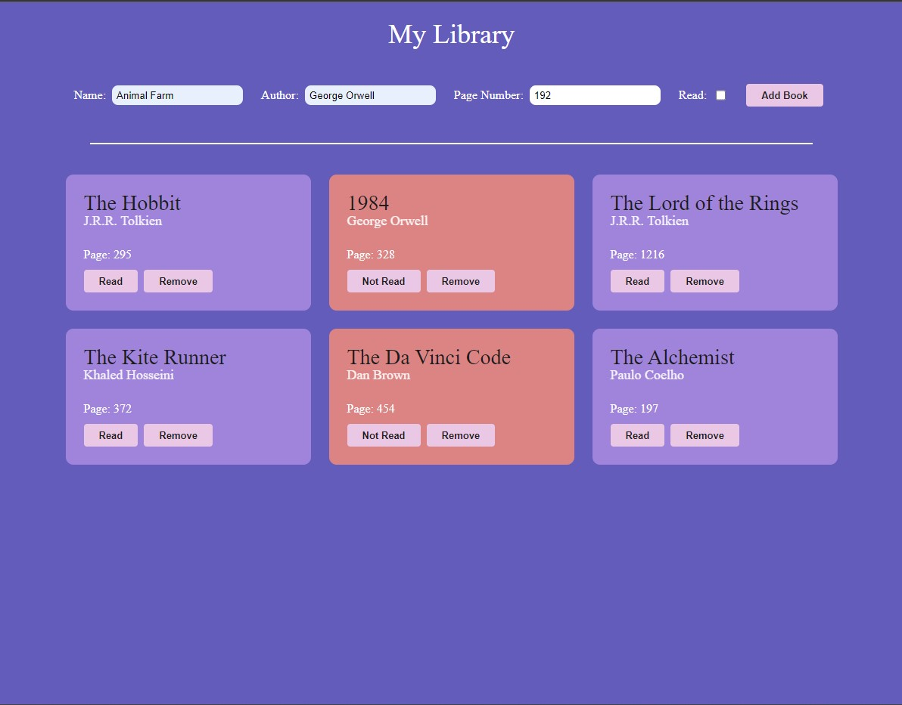
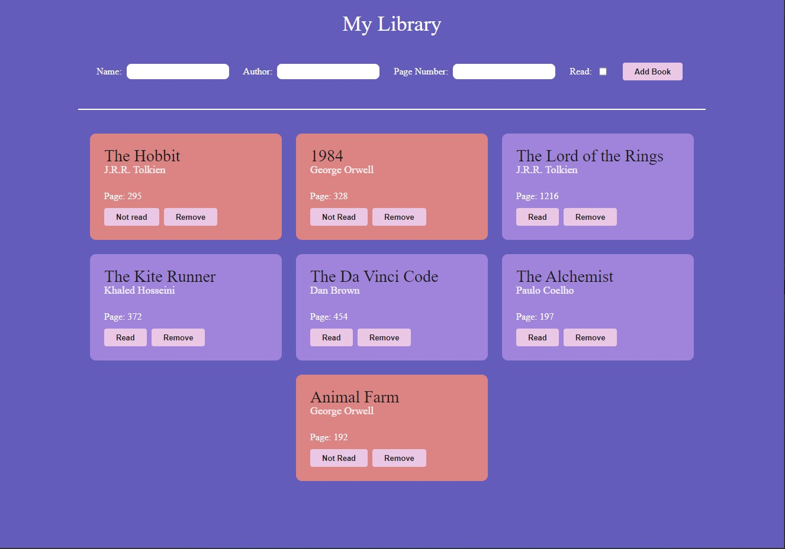

# Library App with JavaScript

You can add books to the library and delete them. You can also change the read status of the books.

## Learnings

- Working with objects and arrays
- DOM manipulation 
- Event listening 

 
 

You can see the live demo [here](https://burakkduran.github.io/library-app/)

## Screenshots
---

---

